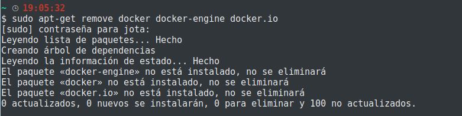
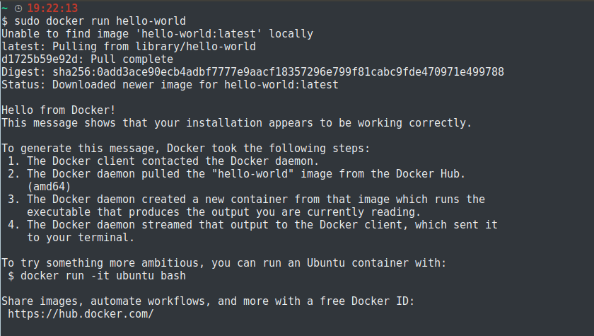

# Utilización e instalación de Docker

1. Limpiamos viejas versiones de Docker de nuestro sistema, para ello:
> sudo apt-get remove docker docker-engine docker.io

2. Actualizamos el paquete __apt__:
> sudo apt-get update

3. Instalamos los paquetes que permiten a __apt__ usar un repositorio sobre HTTPS:
> sudo apt-get install \
      apt-transport-https \
      ca-certificates \
      curl \
      software-properties-common

4. Añadimos la clave oficial GPG de Docker:
> curl -fsSL https://download.docker.com/linux/ubuntu/gpg | sudo apt-key add -

5. Para añadir el repositorio del sistema deseado utilizamos:
> sudo add-apt-repository \
   "deb [arch=amd64] https://download.docker.com/linux/ubuntu \
   $(lsb_release -cs) \
   stable"

6. instalación de "Docker CE":
> sudo apt-get install docker-ce

7. Verificamos que la instalación ha sido correcta mediante:
> sudo docker run hello-world

Información obtenida y para más Información:[Guia oficial Docker](https://docs.docker.com/install/linux/docker-ce/ubuntu/)

### Definición de un contenedor con Dockerfile

En mi caso, crearemos un archivo dockerfile referido a "Python", con la consiguiente información que será la utilizada en el entorno para el correcto funcionamiento de nuestra aplicación. Es decir, aclaramos las dependencias y herramientas que requiere nuestra aplicación para poder funcionar al contenedor. De esta manera quedará automatizado el proceso de la configuración de la imagen del Docker.

~~~~
FROM  python:3.6

WORKDIR /app

COPY . /app

RUN pip install --trusted-host pypi.python.org -r requirements.txt

# Avrimos y utilizamos el puerto 80:
EXPOSE 80

#Aplicación que lanzamos:
CMD ["python3","application.py"]
~~~~

Para construir la imagen utilizamos la orden:
> sudo docker build -f Dockerfile -t "javier1994:findainformatic" .

Arrancamos la imagen y comprobamos que la imagen contiene todos los archivos:
> sudo docker run -i -t "javier1994:findainformatic" /bin/bash

Comprobamos las instalaciones con el comando make y el funcionamiento de la aplicación:

Ahora mediante [Docker Hub]() podremos desplegar en un PaaS nuestro contenedor.
