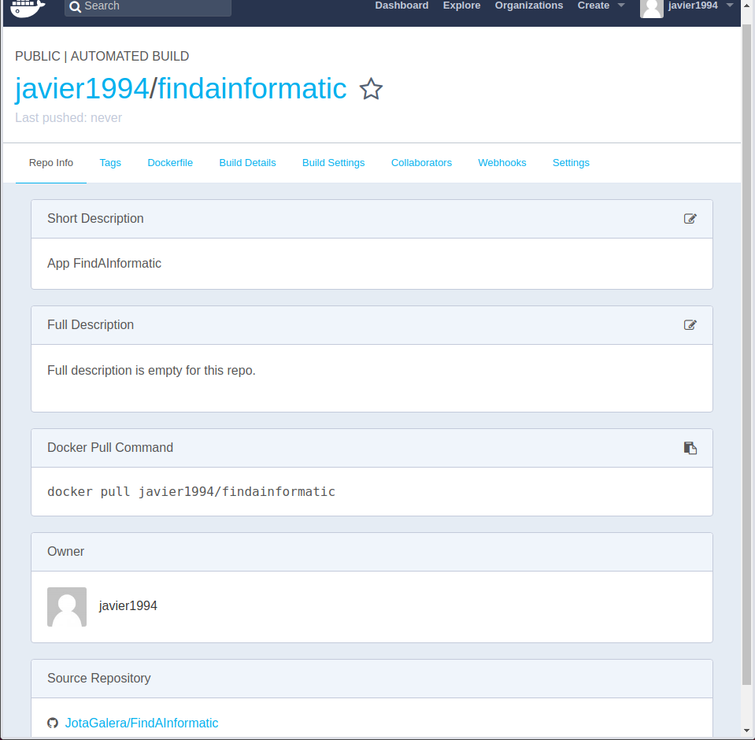

# Despliegue de la aplicación mediante contenedores

En mi caso desplegaré el contenedor en Docker Hub. Para ello debemos seguir estos pasos:

* ***Primero***: Nos debemos crear una cuenta en dicha plataforma.

* ***Segundo***: Linkeamos nuestro Git Hub con nuestra cuenta de Docker Hub, para ello: __NombreCuenta__ > __Settings__ > __Linked Accounts & Services__ > __Link Git Hub__

* ***Tercero***: Seleccionamos repositorio sobre el que trabajar:
__Create__ > __create automated build__ > __create auto-build git hub__ > __"RepositorioDeTrabajo"__. Además podremos añadir la vilibilidad y una breve descripción.

* ***Cuarto***: Como resultado debemos obtener algo así:

Para tratar con Ducker Hub en la terminal he utilizado esta  [Guia](https://docs.docker.com/engine/reference/commandline/login/#extended-description)

Ahora vamos desplegar nuestro contenedor en: [Configuración y despliegue de un contenedor en Heroku](https://github.com/JotaGalera/FindAInformatic/blob/master/docs/Heroku.md)
