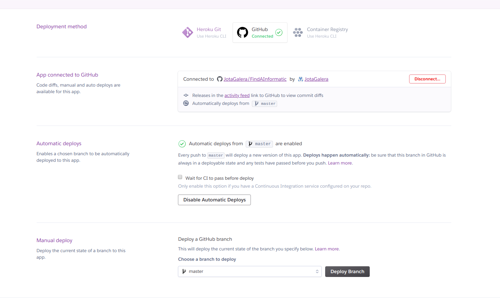
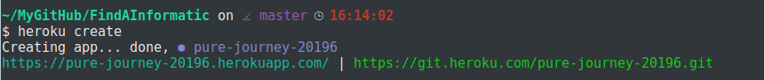
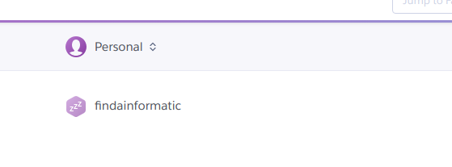
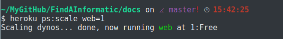
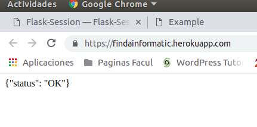

### Instalación y configuración de Heroku:

Primeramente necesitamos tener Heroku en nuestra máquina, para ello escribimos desde la terminal:
~~~~
sudo snap install heroku --classic
~~~~

Una vez instalado nos loggeamos en Heroku mediante:
~~~~
heroku login
~~~~
Nos pedira nuestro usuario y contraseña con el que nos hemos registrado en la página.

Una vez nos encontramos logueados preparamos la aplicación, para ello clonamos el repositorio(desde Git Hub) deseado donde tenemos los archivos de la aplicación en nuestra maquina(en mi caso sería) :
~~~~
git clone https://github.com/JotaGalera/FindAInformatic
~~~~

Dentro de Heroku en la pestaña Depploy, debemos tener activado el apartado "App connected to GitHub" y "Automatic deploys":

Ahora nos movemos a ese repositorio:
~~~~
cd FindAInformatic
~~~~

***Desplegamos ahora la aplicación*** en Heroku.
Ejecutamos la orden(en el repositorio correspondiente, en la máquina local):
~~~~
heroku create
~~~~

Se creará un git remoto(llamado Heroku), el cual estará asociado al repositorio local de git.
El nombre de la aplicación en Heroku es aleatorio, pero podemos cambiarlo para que sea más claro mediante la orden:
~~~~
heroku apps:rename "nuevo-nombre"
~~~~

Heroku no permite letras mayúsculas, espacios, barras bajas, etc. Hay que tenerlo en cuenta a la hora de cambiar el nombre. Una vez lo cambies puedes comprobar que el cambio se ha producido en la misma página(Aunque en la terminal viene reflejado).

Ahora desplegamos el código en Heroku:
~~~~
git push heroku master
~~~~

Acto seguido Heroku detecta el lenguaje en que esta escrita la aplicación, en mi caso Python-3.6.6, pip(administrador de paquetes de sistema) utilizado con Python. También reconoce el fichero "Requiremenets" del repositorio e instala los requisitos que nosotros mismos necesitemos para la aplicación.

Nuestra aplicación ya está desplegada- Nos aseguramos que al menos una instancia de esta se está ejecutando(Para llegar hasta aquí hace falta tener un archivo llamdo "Procfile para asignar los dinos, sino nos dará un error el cual se resulve una vez añadido dicho archivo"):
~~~~
heroku ps:scale web=1
~~~~

~~~~
Contenido del archivo "Procfile":

web: gunicorn application:app
~~~~

Y mediante el comando siguiente , podemos abrir nuestra aplicación web:
~~~~
heroku open
~~~~

