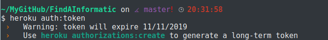
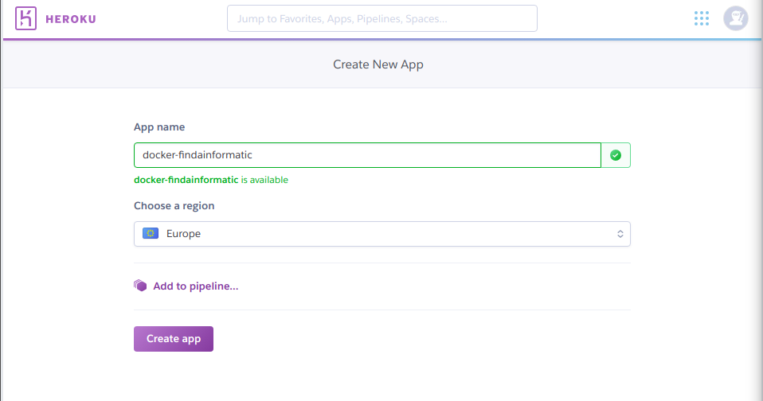
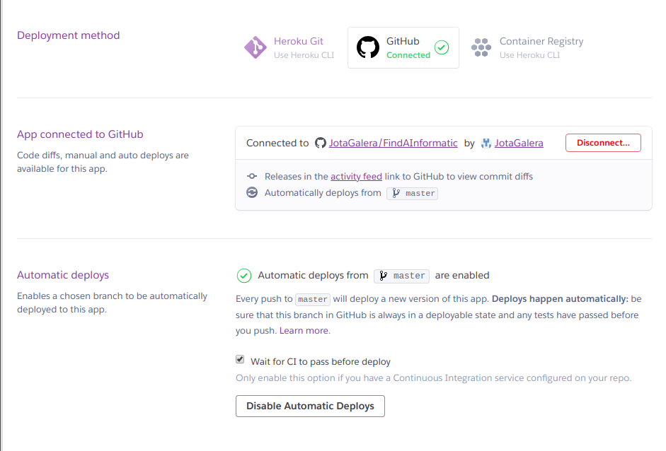
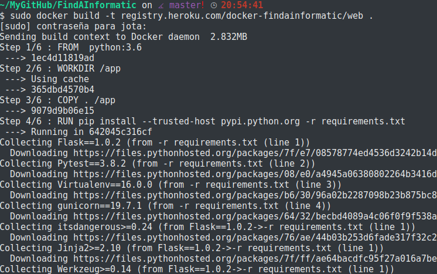
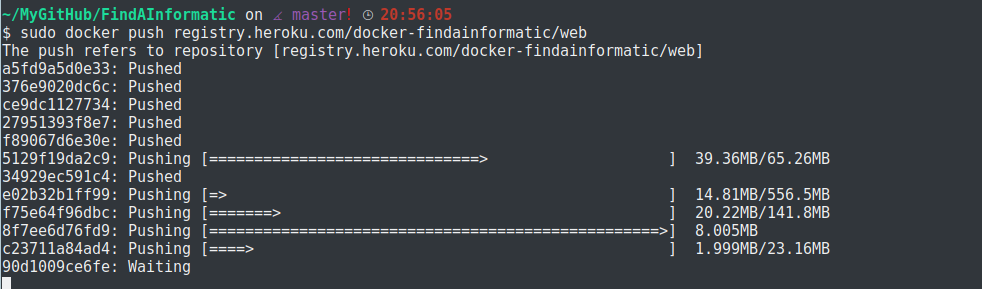
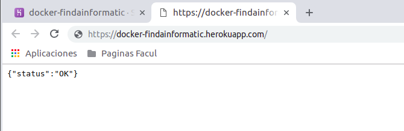

# Configuración y despliegue de la aplicación en Heroku:

* __Primero:__ Nos registramos en Heroku y realizamos el login.

* __Segundo:__ Creamos una nueva aplicación.

* __Tercero:__ Añadimos el nombre de la aplicación y la región:

* __Cuarto:__ Una vez creada la linkeamos con nuestro repositorio:

Además activamos el despliegue automático, de tal manera que nuestra aplicación se actualizará con cada push al repositorio de Git.

Es importante dejar marcada la pestaña "Wait for CI pass before deploy" para seguir manteniendo la Integración continua con Travis.

* __Quinto:__ Añadimos a nuestro archivo "Requiremenets.txt" la librería Gunicorn, que será utilizada por Heroku para desplegar la aplicación.

* __Sexto:__ Es necesario que nuestra aplicación tenga un archivo llamado "Procfile", este archivo especifica los comandos que son ejecutados por la aplicación de Dynos.
En mi caso el contenido sería:
~~~~
web: gunicorn application:app
~~~~

* __Séptimo:__ Comprobamos que la aplicación funciona:

# Configuración y despliegue de un contenedor en Heroku:

Necesitaremos un token que nos proporcionará Heroku para iniciar sesión en el registro de Docker:

* Obtención de Docker:
> heroku auth:token

* Login Docker con el token:
> docker login --username=_ --password="value token" registry.heroku.com

En nuestra cuenta de Heroku creamos una nueva aplicación y activamos el despliegue automático:

Por último subimos la imagen generada antes:
>docker build -t registry.heroku.com/docker-findainformatic/web .
>docker push registry.heroku.com/docker-findainformatic/web

Comprobamos que la aplicación se despliega:

Realizado con ayuda de [Heroku](https://devcenter.heroku.com/articles/container-registry-and-runtime)
