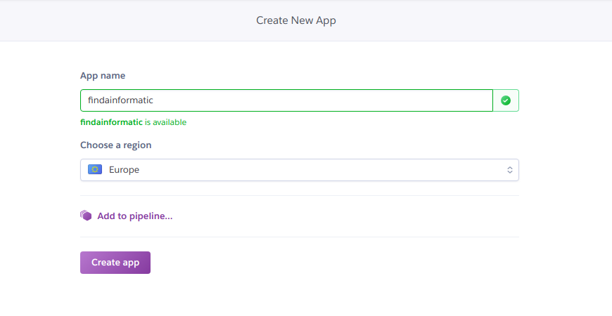
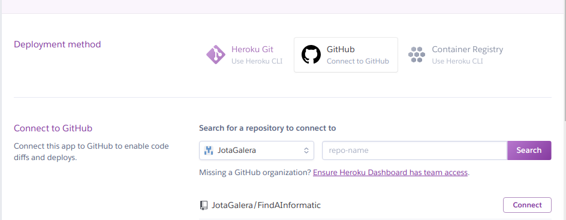

# Configuración y despliegue de la aplicación en Heroku:

1. Nos registramos en Heroku y realizamos el login.

2. Creamos una nueva aplicación.

3. Añadimos el nombre de la aplicación y la región:

4. Una vez creada la linkeamos con nuestro repositorio:

Además activamos el despliegue automático, de tal manera que nuestra aplicación se actualizará con cada push al repositorio de Git.

Es importante dejar marcada la pestaña "Wait for CI pass before deploy" para seguir manteniendo la Integración continua con Travis.
