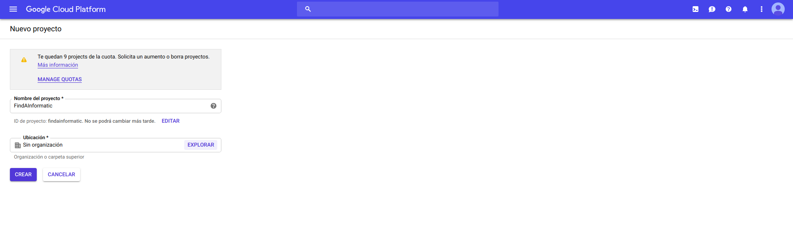
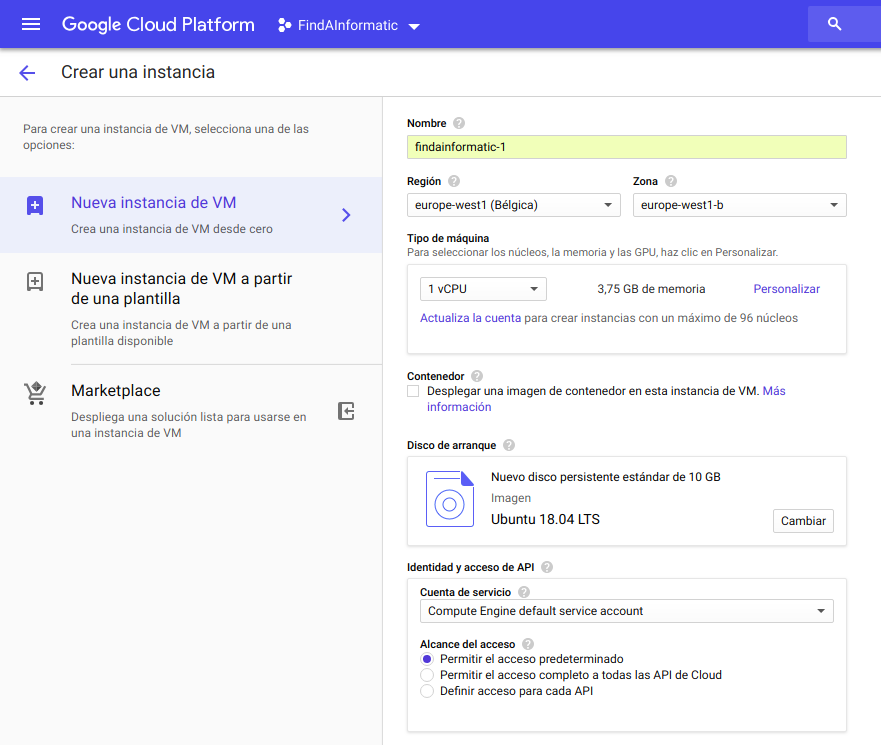
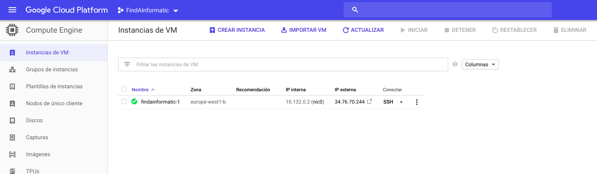
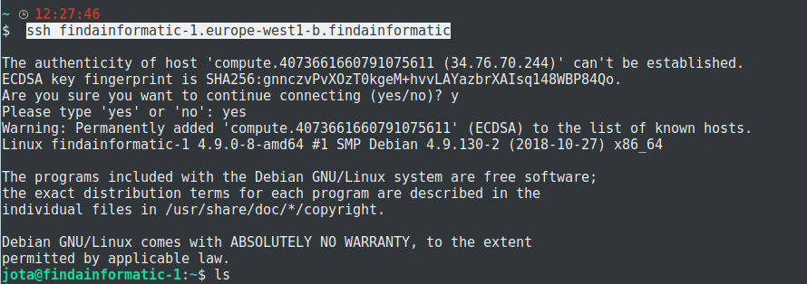
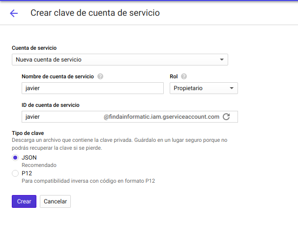
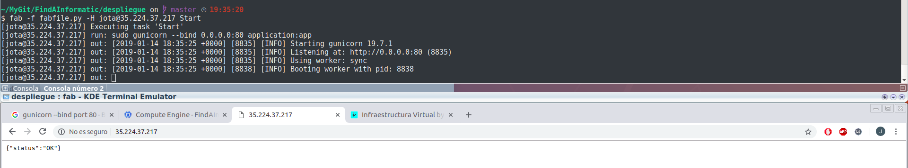

# Documentación del despliegue en IaaS(Google Cloud)

1. De forma loca.

Para evitar trabajos erróneos y futuras sorpresas en el despliegue final, primeramente lo realizaremos de forma local gracias a una herramienta que nos permite crear un entorno aislado de programación.De esta manera si reventase algo, no tendría por qué afectar al resto de trabajos, acabaríamos borrando ese entorno y volviendo a empezar.

Omitiré la propia instalación de Vagrant pero dejaré en este enlace una documentación de como configurar correctamente Vagrant para tenerlo todo perfectamente preparado, [GUIA VAGRANT](https://jotagalera.github.io/FindAInformatic/Vagrant)

2. Pasaremos ahora al despliegue en el IaaS(Google Cloud).

Utilizamos Vagrant para la creación de la máquina y la configuración de estas en Google Cloud, y Fabric([Documentación utilizada de Fabric](http://docs.fabfile.org/en/1.14/tutorial.html)) para el despliegue y ejecución de la aplicación.

***Para nuestra máquina virtual***:

- Necesitaremos un [plugin](https://github.com/mitchellh/vagrant-google) de Vagrant para conectar con Google Cloud:

> vagrant plugin install vagrant-google

[Para posibles errores de dependencias con fog-core](https://github.com/dotless-de/vagrant-vbguest/issues/292)

- Además necesitaremos una "box" que se compatible con dicho plugin, utilizaremos la que nos deja en el [repositorio](https://github.com/mitchellh/vagrant-google)el autor del plugin.

> vagrant box add gce https://github.com/mitchellh/vagrant-google/raw/master/google.box

Para facilitar futuras modificaciones en las MV y demás, podemos utilizar [Cloud Shell](https://cloud.google.com/shell/?hl=es-419).

Lo primero es crear la cuenta para [Google Cloud](https://cloud.google.com/), en dos simples pasos en la página podrás registrarte. Tendrás que dar la cuenta bancaria para iniciar la cuenta gratuita, pero podrás darla de baja, ya que te dan 300$ y 12 meses gratis.

Creamos nuestro proyecto , FindAInformatic en Google Cloud:

***ESTA PARTE ES OPCIONAL***, puesto que Vagrant se ocupará de crear una instancia:

Elegimos un sistema operativo para el arranque, el destino del servidor(en mi caso Belgica es de Europa, el más barato) y acto seguido empezará a crear la instancia:

Ya tenemos nuestra instancia:

---------

La siguiente herramienta es recomendable utilices vagrant o crees la instancia tú mismo, de esta manera se creará directamente una clave para nuestro proyecto y evitaremos tener que crear nosotros mismo el par de claves.

Para podernos conectar por ssh a desde nuestro host directamente a la MV de Google Cloud necesitaremos otra herramienta:[SDK de Google Cloud](https://cloud.google.com/sdk/install)

Mediange el SDK anteriormente instalado, utilizamos en nuestra propia máquina:

> gcloud init

El cual nos lanzará un dialogo , para identificarnos, seleccionar nuestro proyecto y demás.
Utilizaremos también lo que nos permitirá establecer una contraseña para el ssh con nuestra máquina virtual:

> gcloud compute config-ssh

Ya podemos conectarnos por ssh:

> ssh findainformatic-1.europe-west1-b.findainformatic

Antes de seguir con el despliegue, debemos de añadir ciertas credenciales a nuestro proyecto(paso necesario para poder instalar el plugin vagrant-google).

Estas credenciales nos servirán para configurar parte del Vagrantfile, como bien nos explican en su repositorio el autor del plugin vagrant-google.

Partimos de que ya tenemos Vagrant instalado en nuestra máquina por tanto nos saltaremos ese paso.

Para instalar el plugin de Vagrant-google también queda especificado arriba.

Una vez finalazada la instalación, pasamos a la configuración de nuestro Vagrantfile(Como hemos documentado en su documento todo lo referido a Vagrant y Ansible, solo comentaremos la nueva parte, la de Google):

[FUENTE DEL ARCHIVO](https://github.com/mitchellh/vagrant-google)
~~~~

Vagrant.configure("2") do |config|

  config.vm.box = "google/gce"

  config.vm.provider :google do |google, override|
    google.google_project_id = "YOUR_GOOGLE_CLOUD_PROJECT_ID"
    google.google_client_email = "YOUR_SERVICE_ACCOUNT_EMAIL_ADDRESS"
    google.google_json_key_location = "/path/to/your/private-key.json"

    google.image_family = 'ubuntu-1604-lts'

    override.ssh.username = "USERNAME"
    override.ssh.private_key_path = "~/.ssh/google_compute_engine"
  end

end

~~~~

Este será el esqueleto de nuestro Vagrantfile, simplemente lo modificaremos con nuestros datos de las credenciales(el archivo que descargamos anteriormente).

Los 3 primeros datos los obtenemos del archivo de credenciales que obtuvimos antes.

Las dos siguiente lineas son simplemente el usuario con el que conectaremos mediante ssh y el path de la key privada con la que conectamos el proyecto, en mi caso, al utilizar gcloud se genera automático cuando realizamos la configuración de ssh.

~~~~
override.ssh.username = $USER
override.ssh.private_key_path = "~/.ssh/google_compute_engine"
~~~~

Por último queda añadir una última herramienta utilizada [Fabric](http://www.fabfile.org/), una biblioteca de Python que utilizaremos para el control de nuestro servicio web.
Por supuesto, he metido en su rol correspondiente(dependencias) la instalación.El contenido del fabric file es:

[Algo de ayuda para realizar el Fabric file](https://github.com/fabric/fabric/issues/1373)

~~~~
from fabric.api import *

def Install():
  run('git clone https://github.com/JotaGalera/FindAInformatic')
  with cd("~/FindAInformatic/"):
    run('make')

def Start():
  with cd("~/FindAInformatic/"):
    run('sudo gunicorn --bind 0.0.0.0:80 application:app')
    run('pgrep gunicorn > ~/id.tx') //Para asegurarnos que tenemos controlado cual es nuestro gunicorn

def Stop(): //Leemos el PID de nuestro gunicorn y lo matamos
  run(' var=$(head -1 ~/id.txt) ')
  run(' sudo kill $var')

def RemoveAll():
  run ('sudo rm -r ~/*')
~~~~

Por último mostraremos el despliegue de la máquina en funcionamiento:

  - Mediante el comando:
    - fab -f fabfile.py -H jota@35.224.37.217 Start (Iniciar)
    - fab -f fabfile.py -H jota@35.224.37.217 Stop  (Detener)
    - fab -f fabfile.py -H jota@35.224.37.217 RemoveAll  (Limpiar instancia)
    - fab -f fabfile.py -H jota@35.224.37.217 Install (Instala dependencias)

