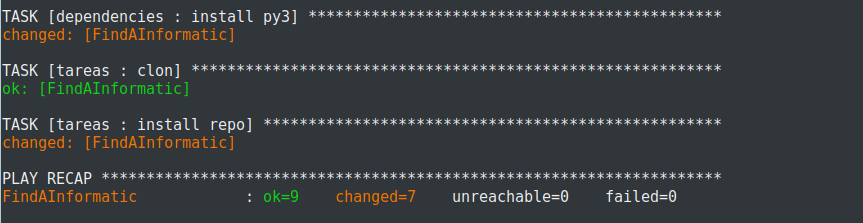

# Documentación sobre Vagrant y Ansible

Vagrant es una herramienta software que nos facilita la instalación y utilización de máquinas virtuales, configuración y provisionamiento.

Ansible será la herramienta que utilizaremos junto a Vagrant para poder automatizar tareas de despliegue.

Obviaremos la instalación de Vagrant, pero a continuación se explicará como crear y configurar nuestro primer entorno:

- En primer lugar debemos elegir la ubicación de nuestro entorno, y nos ubicamos en él:

> mkdir ~/FindAInformatic
> cd ~/FindAInformatic

- Creamos ahora un archivo de configuración ***Vagrantfile*** desde el cual podremos instalar interfaces, abrir puertos, crear carpetas compartidas, ... (En mi caso utilizaré una máquina virtual con bento/Ubuntu 18.04, tambien he probado el despliegue local con una ubuntu/trusty64 que es la que viene en la documentación de Vagrant(0 diferencias a la hora del despliegue),puesto que estoy más familiarizado con la asignatura en la que damos por primera vez esta herramienta "DAI").

> vagrant init

Esta es la forma que tomaría la configuración de nuestro Vagrantfile, lo único que hemos añadido es un puerto por el que podremos acceder a un servicio partir de la ip: 127.0.0.1 y hemos habilitado una carpeta compartida con nuestra máquina local y la virtual(más adelante añadiremos más cosas).

***NOTA:*** Este archivo se crea automáticamente por Vagrant, nosotros solo debemos modificar ciertas lineas que iré explicando, como primera opción podemos elegir el sistema operativo en la linea "config.vm.box", importante aclarar que Vagrant funciona con los llamados Boxes,es la forma en la que en esta herramienta llama a sus entornos.

- Una vez tenemos todo lo referido a Vagrant, pasamos a la instalación y configuración para el uso de Ansible para ello nos guiamos de su propia [documentación](https://docs.ansible.com/ansible/latest/scenario_guides/guide_vagrant.html) y además también de [algún que otro foro bastante interesante](https://www.adictosaltrabajo.com/2015/09/04/creacion-de-entornos-de-integracion-con-ansible-y-vagrant/).

De tal forma que a nuestro archivo Vagrantfile añadimos:

~~~~
Vagrant.configure(2) do |config|   //INICIO DE LA CONFIGURACIÓN

  ...
  lo de antes
  ...

  config.vm.define "FindAInformatic" do |FindAInformatic|
    config.vm.provision "ansible" do |ansible|
      ansible.become = true
      ansible.inventory_path = "ansible/environments/findainformatic/inventory"
      ansible.verbose = "vvvv"
      ansible.playbook =  "ansible/playbook.yml"
    end
  end
end
~~~~

Vamos a explicar un poco que significa esta retahíla de letras sin sentido aparente:
***Vagrant.configure(2) do |config|*** : el "2" representa la versión de Vagrant que utilizaremos, en mi caso utilizo la 2, para ser más exactos la 2.0.3, esta linea no es restrictiva, quiero decir, podríamos añadirle al mismo Vagrantfile dos Vagrant.configure(x), el primero con un 1 y el segundo con un dos dentro del mismo archivo, pudiendo diferencia cómo se hará o qué se hará en función de la versión de Vagrant que se utilice,[para más información](https://www.vagrantup.com/docs/vagrantfile/version.html).

Las tres lineas que tenía nuestro Vagrant al principio son configuraciones sobre nuestro entorno, ***config.vm.box***(donde elegimos nuestro sistema operativo) , ***config.vm.network***(donde estamos creando nuestro mapa interno de redes, el auto_correct sirve para que si hay algun conflicto con los puertos designados, Vagrant se ocupe de solucionarlo) y ***config.vm.synced_folder***(indicamos una carpeta que compartira nuestra maquina virtual con nuestra propia máquina).

***config.vm.define***: Estamos especificando un entorno para nuestra máquina virtual, de tal forma que todas las propiedades que vienen a continuación, solo afectarán a esta máquina.

***config.vm.provision***: Aquí estamos definiendo el aprovisionamiento de la máquina a través de ansible.

Estas cuatro líneas son referentes totalmente a ***Ansible***:

***ansible.become***:[Documentación](https://ansible-docs.readthedocs.io/zh/stable-2.0/rst/become.html) , sirve para permitir a usuarios realizar tareas como si tuvieran otros privilegios.
***ansible.inventory_path***: La ruta donde se encuentra el archivo ***inventory***, explicado más adelante.
***ansible.verbose***: Para que muestre  información de depuración durante el despliegue.
***ansible.playbook***: ruta del ***playbook*** explicando más adelante.

***NOTA:*** Una vez funcione el despliegue local, en mi caso elimino el "verbose", para evitar tanta información de la que estoy seguro que ya funciona.

- Dentro de nuestro directorio donde hemos establecido Vagrant, en mi caso FindAInformatic, crearemos una ruta de directorios "ansible/environments/findainformatic/", en dicho directorio, se creará un archivo que se llamará ***inventory*** en el cual podemos definir nuestro host , como realizaremos la comunicación con él y el grupo al que pertenece, entre otras cosas, esto es debido a que a la hora de desplegar, podríamos querer desplegar más de una máquina, por lo que podríamos añadir a esa lista otras para automatizarla y no tener que hacer el despliegue de uno en uno.Este sería el aspecto del mio:

~~~~
FindAInformatic ansible_ssh_host=127.0.0.1 ansible_ssh_port=2217
ansible_user=vagrant ansible_ssh_pass=vagrant

[fi]
FindAInformatic
~~~~

***NOTA***: sabremos el nombre de la máquina, porque debe ser el mismo que en Vagrant.

- Otra de las cosas que te permite Ansible es trabajar con variables sobre las futuras tareas que se deberán realizar. Estas variables estarán en un fichero tal que "FindAInformatic/group_vars/FindAInformatic". En nuestro caso no serán necesarias de momento.

- En este punto debemos crear el ***playbook***. En definitiva, este archivo se utiliza para definir las tareas que se ejecutarán en nuestra máquina. La idea es darle las instrucciones a nuestra máquina para que se actualice , instale ansible, instale automáticamente git, clone nuestro repositorio,..., automatizando así casi todo el trabajo.

~~~~
Contenido del archivo "playbook.yml"

---
- hosts: fi
  remote_user: vagrant
  become: yes
  roles:
    - update
    - ansible
    - dependencies
    - tareas
~~~~

El ***host*** es una lista de uno o más grupos de hosts(el grupo definimos en el inventory).
El ***remote_user*** es solo el nombre de la cuenta de usuario, en vagrant viene por defecto el usuario vagrant.
Los ***roles*** son una lista de tareas que deberá realizar de arriba a abajo, la intención de separarlas en roles y no ponerlas ahí directamente es para poder crear o quitar a nuestro antojo en caso de cualquier cambio en una futura máquina nueva.(Para ello creamos un directorio dentro de nuestra carpeta compartida con Vagrant el cual llamaremos "roles".)

Dicho directorio tendrá una estructura tal que:

- roles/[nombre_rol]/tasks/main.yml: estos archivos contendrán las tareas del rol.
- roles/[nombre_rol]/handlers/main.yml: los handlers darán respuestas a eventos que pueden cambiar el estado de las tareas.
- roles/[nombre_rol]/templates/main.yml: aquí irán las plantillas de los ficheros que se podrán modificar mediante variables.
- roles/[nombre_rol]/files/main.yml: ficheros por defecto, sin modificaciones. Cuando en sistema necesite un fichero por defecto vendrá aquí.

Un poco de ayuda para la creación de los roles, [documentación](https://docs.ansible.com/ansible/latest/modules/apt_module.html)

En primer lugar actualizamos la maquina para ello en ***"FindAInformatic/ansible/roles/update/tasks/main.yml"*** escrimibos:
~~~~
- name: update
  command: sudo apt-get update

~~~~

Además instalaremos ansible en la máquina para automatizar tareas como los despliegues:
Para ***"FindAInformatic/ansible/roles/ansible/tasks/main.yml"***, [guia](https://medium.com/@perwagnernielsen/ansible-tutorial-part-2-installing-packages-41d3ab28337d)

~~~~
- name: install python
  apt: name=python-setuptools state=present update_cache=yes
  tags: ansible

- name: install pip
  command: easy_install pip
  tags: ansible

- name: install ansible
  command: pip install ansible
  tags: ansible
~~~~

Para ***"FindAInformatic/ansible/roles/dependencies/tasks/main.yml"***:
Este rol lo utilizaremos para incluir las dependencias.Nosotros necesitaremos que instale "git" , además de que clone el repositorio, por tanto el contenido será:

~~~~
- name: install git
  apt: name=git state=present
  tags: git

- name: install py3
  command: sudo apt-get install -y python3-pip
  tags: py3

~~~~
El tags nos permite, al correr ansible, que podamos especificar que ejecute solo las tareas con un tag determinado.

Por último en ***"FindAInformatic/ansible/roles/tareas/tasks/main.yml"***:
Aquí añadiremos la parte encargada de clonar el repositorio y realizar la instalación de los requisitos para que funcione correctamente nuestra aplicación:
[Guia](https://www.jeffgeerling.com/blog/2018/cloning-private-github-repositories-ansible-on-remote-server-through-ssh).
~~~~
- name: clon
  git:  repo=https://github.com/JotaGalera/FindAInformatic.git dest=FindAInformatic/ clone=yes force=yes
  tags: clon

- name: install repo
  command: pip3 install -r FindAInformatic/requirements.txt
~~~~

- Al lanzar la maquina virtual mediante el siguiente comando, se bajará automáticamente la imagen de Ubuntu.

> vagrant up

Con esto encontraremos algo similar a lo siguiente (en mi caso he omitido la opción del Vagrantfile->ansible.verbose = "vvvv" para mostrar menos información ahora que ya sabemos que funciona todo ):

- En cuanto termine podemos acceder mediante ssh:

> vagrant ssh
